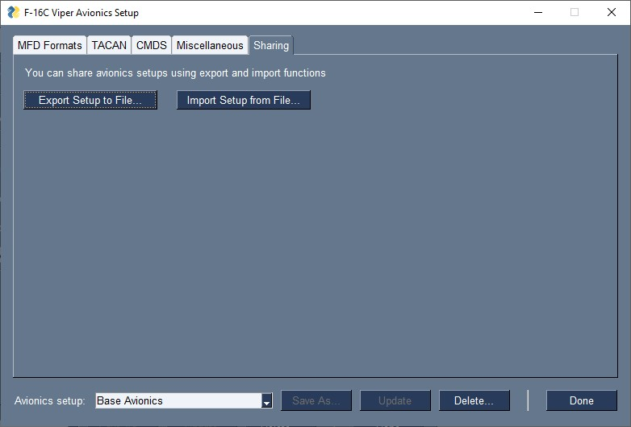

# Avionics Setup

DCC Waypoint Editor (DCSWE) currently supports avionics setup for selected airframes:

- [F-16C Viper](https://github.com/51st-Vfw/DCSWaypointEditor/blob/master/documentation/Avionics_Setup_F16.md)

Avionics setup is effectively always whatever the default DCS state for avionics is on
unsupported airframes.

> **NOTE:** This functionality eventually will be replaced by DCS DTC support.

Because DCSWE cannot always determine avionics state (for example, DCSWE is unable to
determine which MFD format is currently selected), DCSWE makes several assumptions,
detailed in the airframe-specific discussions, around the initial configuration of the
avionics. These assumptions match the state of the avionics following a cold start or
after entering the jet in a hot start before any modifications are made to avionics state.

> **NOTE:** If the state does not match the expected initial configuration, the updates
> that DCSWE performs may not yield the desired results.

Avionics setup can be done as part of loading a profile or a mission (in DCSWE JSON
format) into the jet. For non-native mission setups (e.g., from a CombatFlite export),
you can either import into a native DCSWE profile and specify the avionics setup through
that DCSWE profile, or tell DCSWE (through preferences) to use a default avionics setup
when configuring the jet using non-native sources.

As with waypoint entry, it is important to minimize interactions with the jet while
DCSWE is driving the cockpit switches.

## Overview

DCSWE stores avionics setups in its database. Each setup has a unique name along with
the appropriate airframe-specific settings. These setups can be associated with a profile
and loaded into the jet. Avionics setups are edited by Clicking the avionics setup
"`Edit`" button in the
[main DCSWE user interface](TODO).
Doing so brings up a window that allows you to edit the selected avionics setup.

Each airframe always has a "DCS Default" setup that corresponds to the default state of
the avionics in DCS following a hot start or cold start. This setup cannot be changed or
edited.

## Common User Interface Elements

The interface to edit an avionics setup consists of a set of tabs and some common
controls to manage avionics setups.

With the exception of the "`Sharing`" tab, all tabs are specific to a particular
airframe.

### Management Controls

Along the bottom of the window there is a drop-down menu that selects the avionics
setup to edit. You can select other setups from this menu at any time. There are three
buttons that support managing setups,

- *Save As...:* Saves the current avionics setup to a new setup in the DCSWE database.
- *Update:* Save the setup to the DCSWE database.
- *Delete...:* Delete the current avionics setup from the DCSWE database.

The "`Done`" button in the lower right corner dismisses the avionics setup editor and
returns you to the main interface.

### Sharing Tab

The "`Sharing`" tab allows you to share avionics setups through import and export
functions. Clicking the "`Export Setup to File...`" will allow you to specify a local
text file to write the current setup to. Setups exported in this fashion can be later
imported into DCSWE using the "`Import Setup from File...`" button.